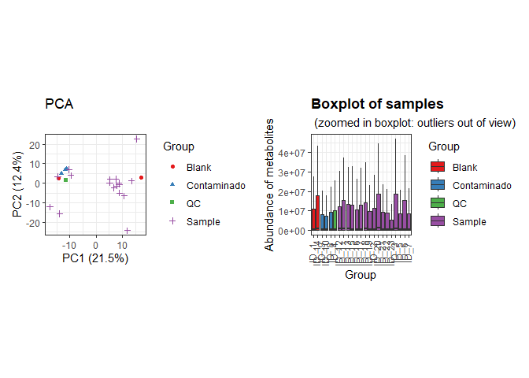

GC-MS of soil before and after mycoremediation
================
Isabel Cipriani, Jefferson Pastuña
2023-11-20

- <a href="#introduction" id="toc-introduction">Introduction</a>
- <a href="#before-to-start" id="toc-before-to-start">Before to start</a>
- <a href="#notame-workflow" id="toc-notame-workflow">Notame workflow</a>
- <a href="#preprocessing" id="toc-preprocessing">Preprocessing</a>

## Introduction

The present document aims to record the procedure given for the
statistical analysis of secondary metabolites present in the different
soil sample. For each step a brief explanation, the code and graphics
obtained are included.

The workflow used is taken from the paper [“notame”: Workflow for
Non-Targeted LC–MS Metabolic
Profiling](https://doi.org/10.3390/metabo10040135). Which offers a wide
variety of functions to perform metabolomic profile analysis.

## Before to start

The “notame” package accepts as input a feature table that can be
obtained through software such as MZMine, MSDial, among others. In this
case, the feature table was obtained with the help of GNPS by MSHub
algorithm. The (\*.csv) file (downloaded from GNPS job
[ID=838e81abada84d709557cf3bb1e16fba](http://838e81abada84d709557cf3bb1e16fba/))
was slightly modified to obtain the final feature table to notame R
package.

Modifications made to the raw (\*.csv) file can be summarized in adding
and renaming columns. The added columns “Column” and “Ion Mode” allow to
analyze samples with different types of columns and with different
ionization modes respectively. Also, the cells corresponding to mass and
retention time must be renamed so that the package can detect and
process it.

## Notame workflow

As a first step for the analysis, all the necessary libraries were
installed and loaded.

``` r
library(notame)
library(Biobase)
library(BiocGenerics)
library(futile.logger)
library(ggplot2)
library(magrittr)
library(foreach)
library(iterators)
library(parallel)
library(doParallel)
library(pcaMethods)
library(patchwork)
library(cowplot)
library(Rtsne)
library(ggdendro)
library(dplyr)
library(readxl)
library(ggsci)
library(missForest)
```

Then, a project path and a log system was added to have a record of each
process executed.

``` r
ppath <- "C:/Users/F4ss0/Documents/Ikiam21062022/Soil_Mycoremediation/"
init_log(log_file = paste0(ppath, "Result/log.txt"))
```

    ## INFO [2023-11-20 21:16:45] Starting logging

Next, the feature list was imported.

``` r
data <- read_from_excel(file = "Data/GCMS_soil_to_R.xlsx", sheet = 2, 
                        corner_row = 4, corner_column = "G", 
                        split_by = c("Column", "Ion Mode"))
```

Once the data was read, the next step was to create a MetaboSet in order
to create a specific R object.

``` r
modes <- construct_metabosets(exprs = data$exprs, 
                              pheno_data = data$pheno_data, 
                              feature_data = data$feature_data,
                              group_col = "Group")
```

Finally, each mode was extracted in a single object.

``` r
mode <- modes$PREGUNTAR_EI
```

As a additional step, we can visualize the raw data in order to inspect
the processing routines.

``` r
# Data extraction of all dataset
test_mode <- modes$PREGUNTAR_EI
# Boxplot and PCA
test_sambx <- plot_sample_boxplots(test_mode)
test_pca <- plot_pca(test_mode)
test_pca + test_sambx
```

<!-- -->

## Preprocessing

The first step of the preprocessing is to change the features with value
equal to 0 to NA.

``` r
mode <- mark_nas(mode, value = 0)
```

Contaminant peaks based on the process blank will be removed.

``` r
# Removal of contaminants
mode_flag_blank <- flag_contaminants(mode,
                                        blank_col = "Group",
                                        blank_label = "Blank",
                                        flag_thresh = 0.50,
                                        flag_label = "Contaminant")
# Export to Excel (data with blank flag)
write_to_excel(mode_flag_blank, "Result/Blank_Flag.xlsx")
# Removal blank group from dataset
no_group_blank <- mode_flag_blank[, mode_flag_blank$Group != "Blank"]
# Removal blank features
no_group_blank <- drop_flagged(no_group_blank)
# Export to Excel (data without blank flag)
write_to_excel(no_group_blank, "Result/Without_Blank.xlsx")
```

Finish a record.

``` r
finish_log()
```

    ## INFO [2023-11-20 21:16:57] Finished analysis. Mon Nov 20 21:16:57 2023
    ## Session info:
    ## 
    ## INFO [2023-11-20 21:16:57] R version 4.2.2 (2022-10-31 ucrt)
    ## INFO [2023-11-20 21:16:57] Platform: x86_64-w64-mingw32/x64 (64-bit)
    ## INFO [2023-11-20 21:16:57] Running under: Windows 10 x64 (build 19045)
    ## INFO [2023-11-20 21:16:57] 
    ## INFO [2023-11-20 21:16:57] Matrix products: default
    ## INFO [2023-11-20 21:16:57] 
    ## INFO [2023-11-20 21:16:57] locale:
    ## INFO [2023-11-20 21:16:57] [1] LC_COLLATE=Spanish_Spain.utf8  LC_CTYPE=Spanish_Spain.utf8   
    ## INFO [2023-11-20 21:16:57] [3] LC_MONETARY=Spanish_Spain.utf8 LC_NUMERIC=C                  
    ## INFO [2023-11-20 21:16:57] [5] LC_TIME=Spanish_Spain.utf8    
    ## INFO [2023-11-20 21:16:57] 
    ## INFO [2023-11-20 21:16:57] attached base packages:
    ## INFO [2023-11-20 21:16:57] [1] parallel  stats     graphics  grDevices utils     datasets  methods  
    ## INFO [2023-11-20 21:16:57] [8] base     
    ## INFO [2023-11-20 21:16:57] 
    ## INFO [2023-11-20 21:16:57] other attached packages:
    ## INFO [2023-11-20 21:16:57]  [1] missForest_1.5       ggsci_3.0.0          readxl_1.4.2.9000   
    ## INFO [2023-11-20 21:16:57]  [4] dplyr_1.1.0          ggdendro_0.1.23      Rtsne_0.17          
    ## INFO [2023-11-20 21:16:57]  [7] cowplot_1.1.2        patchwork_1.1.2.9000 pcaMethods_1.90.0   
    ## INFO [2023-11-20 21:16:57] [10] doParallel_1.0.14    iterators_1.0.14     foreach_1.5.2       
    ## INFO [2023-11-20 21:16:57] [13] notame_0.2.1         magrittr_2.0.3       ggplot2_3.4.1.9000  
    ## INFO [2023-11-20 21:16:57] [16] futile.logger_1.4.3  Biobase_2.58.0       BiocGenerics_0.44.0 
    ## INFO [2023-11-20 21:16:57] 
    ## INFO [2023-11-20 21:16:57] loaded via a namespace (and not attached):
    ## INFO [2023-11-20 21:16:57]  [1] tidyselect_1.2.0     xfun_0.37            purrr_1.0.1         
    ## INFO [2023-11-20 21:16:57]  [4] colorspace_2.1-0     vctrs_0.5.2          generics_0.1.3      
    ## INFO [2023-11-20 21:16:57]  [7] usethis_2.1.6        htmltools_0.5.4      viridisLite_0.4.1   
    ## INFO [2023-11-20 21:16:57] [10] yaml_2.3.7           utf8_1.2.3           rlang_1.0.6         
    ## INFO [2023-11-20 21:16:57] [13] gert_1.9.2           pillar_1.8.1         glue_1.6.2          
    ## INFO [2023-11-20 21:16:57] [16] withr_2.5.0          RColorBrewer_1.1-3   rngtools_1.5.2      
    ## INFO [2023-11-20 21:16:57] [19] doRNG_1.8.6          lambda.r_1.2.4       lifecycle_1.0.3     
    ## INFO [2023-11-20 21:16:57] [22] munsell_0.5.0        gtable_0.3.1         cellranger_1.1.0    
    ## INFO [2023-11-20 21:16:57] [25] zip_2.2.2            codetools_0.2-18     evaluate_0.20       
    ## INFO [2023-11-20 21:16:57] [28] labeling_0.4.2       knitr_1.42           fastmap_1.1.0       
    ## INFO [2023-11-20 21:16:57] [31] sys_3.4.1            fansi_1.0.4          highr_0.10          
    ## INFO [2023-11-20 21:16:57] [34] itertools_0.1-3      Rcpp_1.0.10          openssl_2.0.5       
    ## INFO [2023-11-20 21:16:57] [37] scales_1.2.1         formatR_1.14         farver_2.1.1        
    ## INFO [2023-11-20 21:16:57] [40] fs_1.6.1             credentials_1.3.2    askpass_1.1         
    ## INFO [2023-11-20 21:16:57] [43] digest_0.6.31        stringi_1.7.12       openxlsx_4.2.5.2    
    ## INFO [2023-11-20 21:16:57] [46] grid_4.2.2           cli_3.6.0            tools_4.2.2         
    ## INFO [2023-11-20 21:16:57] [49] tibble_3.1.8         randomForest_4.7-1.1 futile.options_1.0.1
    ## INFO [2023-11-20 21:16:57] [52] tidyr_1.3.0          pkgconfig_2.0.3      MASS_7.3-58.1       
    ## INFO [2023-11-20 21:16:57] [55] rmarkdown_2.20       rstudioapi_0.14      R6_2.5.1            
    ## INFO [2023-11-20 21:16:57] [58] compiler_4.2.2
